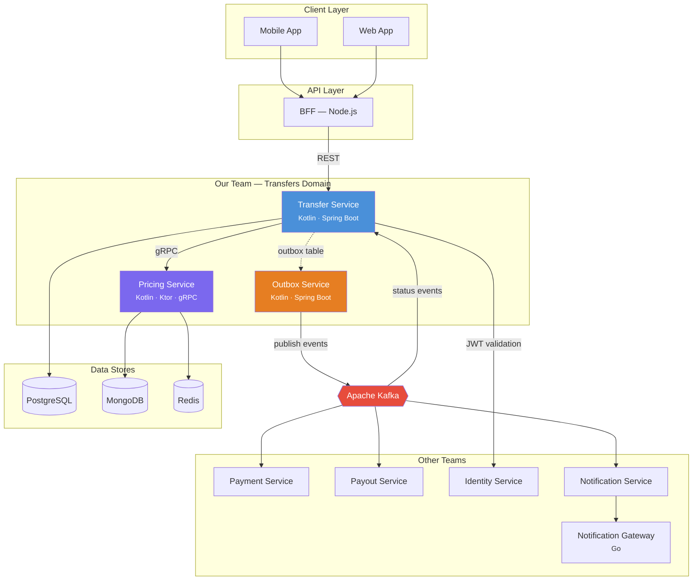

# TransferHub — Cross-Border Remittance Platform

> Event-driven microservices platform for international money transfers.
> Built with Kotlin, Spring Boot, Ktor, gRPC, Kafka, PostgreSQL, and Redis.

[](https://github.com/przhevallsky/transferboss/actions/workflows/ci.yml)

TransferHub is a backend platform for cross-border money transfers — sending money internationally with multiple delivery methods (bank deposit, cash pickup, mobile wallet), real-time status tracking, and transparent pricing.

The system is built as a set of event-driven microservices with Apache Kafka as the central communication backbone. It demonstrates production-grade engineering practices: Transactional Outbox for guaranteed event delivery, distributed locking with Consul, gRPC for low-latency inter-service calls, and comprehensive observability.

**This is the Transfers Domain** — one of several domains in the organization. Our team owns Transfer Service, Pricing Service, and Outbox Service.

## Architecture



## Services

| Service | Tech Stack | Port | Protocol | Database | Purpose |
|---------|-----------|------|----------|----------|---------|
| **Transfer Service** | Kotlin · Spring Boot 3 | 8080 | REST | PostgreSQL, Redis | Core business logic — transfer lifecycle, state machine, saga orchestration, idempotency |
| **Pricing Service** | Kotlin · Ktor | 8082 (HTTP) · 50051 (gRPC) | gRPC + REST | MongoDB, Redis | Quote calculation — fees, exchange rates, rate locks. Latency-critical: p99 < 150ms |
| **Outbox Service** | Kotlin · Spring Boot 3 | 8081 | Kafka Producer | PostgreSQL (reads outbox table) | Transactional Outbox — polls outbox table, publishes events to Kafka with ordering guarantees |
| Notification Gateway | Go *(Sprint 3)* | 8090 | REST | — | Multi-channel delivery: push, SMS, email. High throughput, minimal resource footprint |

## Tech Stack

| Category | Technology | Why |
|----------|-----------|-----|
| **Languages** | Kotlin 2.0, Java 21, Go *(Sprint 3)* | Kotlin — primary (idiomatic, coroutines, null safety). Go — for high-throughput infra services |
| **Frameworks** | Spring Boot 3.3, Ktor 2.3 | Spring Boot — rich ecosystem for CRUD/transactional services. Ktor — lightweight, coroutines-native for latency-critical services |
| **Messaging** | Apache Kafka 3.7 (KRaft) | Event backbone. Ordering per transfer (key=transfer_id), replay, multi-consumer. KRaft mode — no ZooKeeper dependency |
| **Databases** | PostgreSQL 16, MongoDB 7 | PostgreSQL — ACID for financial transactions. MongoDB — flexible nested configs (corridor → delivery methods → fee tiers) |
| **Caching** | Redis 7 | Sub-ms latency for hot path: exchange rate cache (TTL 30s), rate locks, idempotency keys |
| **Inter-service** | gRPC + Protobuf, REST | gRPC — Transfer↔Pricing (200 RPS, 5ms vs 15ms REST). REST — external API |
| **Coordination** | Consul 1.18 | Distributed locking for concurrent transfer mutations (CP system, Raft consensus) |
| **Build** | Gradle 8.10 (Kotlin DSL), Go Modules | Gradle — incremental builds, version catalog, multi-module. Go Modules — standard for Go |
| **CI/CD** | GitHub Actions | Per-service jobs with change detection, Gradle caching, CI Gate pattern |
| **Containerization** | Docker (multi-stage builds) | Non-root, minimal images (JRE-alpine for JVM, scratch for Go) |
| **Orchestration** | Kubernetes + Helm *(Sprint 5)* | EKS, HPA, rolling updates, health probes |
| **IaC** | Terraform *(Sprint 5)* | VPC, EKS, RDS, ElastiCache — all infrastructure as code |
| **Observability** | Prometheus, Grafana, Loki, Tempo *(Sprint 5)* | Metrics + Logs + Traces — connected via traceId for fast root cause analysis |

## Key Architecture Patterns

- **Transactional Outbox** — business data + event written in single DB transaction. Outbox Service polls and publishes to Kafka. Guarantees at-least-once delivery without 2PC.
- **Idempotent Consumer** — deduplication by event_id on consumer side. Kafka's at-least-once delivery means duplicates are expected.
- **Idempotent API** — `X-Idempotency-Key` header prevents double-submit (e.g., user taps "Send" twice). Stored in PostgreSQL with unique constraint + Redis cache.
- **Distributed Locking (Consul)** — coordinates concurrent mutations (cancel + refund) across service replicas. CP guarantee via Raft consensus.
- **Saga (Choreography)** — transfer lifecycle spans Payment → Compliance → Payout. Each step emits events; compensating events on failure.
- **Event-Driven Architecture** — services communicate via Kafka events. Loose coupling, independent deployment, event replay for recovery.
- **Database-per-Service** — each service owns its data store. No shared databases between services.
- **Redirect & Retry Topic** — preserves event ordering during failures. Failed events redirect subsequent events for same transfer_id to retry topic.
- **Circuit Breaker** *(Sprint 4)* — Resilience4j for external API calls (exchange rate provider, payment gateway).
- **CQRS-lite** *(Sprint 4)* — write path (PostgreSQL) separated from read path (Redis cache for status queries, ClickHouse for analytics).

## Quick Start

### Prerequisites

- **Docker** & **Docker Compose** (v2+)
- **JDK 21** ([Eclipse Temurin](https://adoptium.net/))
- **Git**

### 1. Clone & start infrastructure

```bash
git clone https://github.com/przhevallsky/transferboss.git
cd transferhub

# Start all infrastructure (PostgreSQL, MongoDB, Redis, Kafka, Consul)
cd infra/docker
docker compose up -d

# Verify everything is healthy
docker compose ps
```

Expected output — all services `healthy`:

```
NAME                    STATUS
transferhub-postgres    Up (healthy)
transferhub-mongo       Up (healthy)
transferhub-redis       Up (healthy)
transferhub-kafka       Up (healthy)
transferhub-consul      Up (healthy)
transferhub-kafka-init  Exited (0)      ← one-shot container, created topics and stopped
```

### 2. Build & test all services

```bash
cd ../..  # back to project root

# Compile all services (includes Protobuf code generation for Pricing Service)
./gradlew compileKotlin

# Run all tests (Testcontainers will start PostgreSQL and Kafka automatically)
./gradlew test

# Build all JARs / distributions
./gradlew build -x test
```

### 3. Run individual services

```bash
# Terminal 1 — Transfer Service (port 8080)
./gradlew :services:transfer-service:bootRun

# Terminal 2 — Outbox Service (port 8081)
./gradlew :services:outbox-service:bootRun

# Terminal 3 — Pricing Service (port 8082 HTTP, 50051 gRPC)
./gradlew :services:pricing-service:run
```

### 4. Verify

```bash
# Transfer Service health
curl http://localhost:8080/actuator/health

# Outbox Service health
curl http://localhost:8081/actuator/health

# Pricing Service health
curl http://localhost:8082/health/live

# Consul UI
open http://localhost:8500

# Swagger UI (Transfer Service)
open http://localhost:8080/swagger-ui
```

## Project Structure

```
transferhub/
├── services/
│   ├── transfer-service/           # Kotlin / Spring Boot 3 — core business logic
│   │   ├── src/main/kotlin/        #   Domain model, REST API, Saga, Outbox writes
│   │   ├── src/main/resources/     #   application.yml, Flyway migrations
│   │   ├── src/test/               #   Unit + integration tests (Testcontainers)
│   │   ├── build.gradle.kts
│   │   └── Dockerfile
│   ├── outbox-service/             # Kotlin / Spring Boot 3 — outbox polling → Kafka
│   │   ├── src/main/kotlin/        #   Outbox poller, Kafka producer, batch processing
│   │   ├── build.gradle.kts
│   │   └── Dockerfile
│   ├── pricing-service/            # Kotlin / Ktor — quotes, fees, exchange rates
│   │   ├── src/main/kotlin/        #   gRPC service, REST endpoints, rate calculation
│   │   ├── src/main/proto/         #   Protobuf contract definitions (.proto files)
│   │   ├── build.gradle.kts        #   Includes protobuf-gradle-plugin for code generation
│   │   └── Dockerfile
│   └── notification-gateway/       # Go (Sprint 3) — multi-channel delivery
├── infra/
│   ├── docker/
│   │   ├── docker-compose.yml      # Local dev: PostgreSQL, MongoDB, Redis, Kafka, Consul
│   │   ├── postgres/init/          # Auto-creates databases on first start
│   │   ├── mongo/init/             # Auto-creates collections + seed data
│   │   └── kafka/init/             # Auto-creates all Kafka topics
│   ├── helm/                       # Kubernetes Helm charts (Sprint 5)
│   └── terraform/                  # AWS infrastructure as code (Sprint 5)
├── docs/
│   ├── adr/                        # Architecture Decision Records
│   ├── diagrams/                   # Architecture diagrams (Levels 1-4)
│   └── runbooks/                   # Operational runbooks
├── .github/
│   └── workflows/ci.yml           # CI pipeline: lint → test → build → Docker
├── gradle/
│   └── libs.versions.toml          # Centralized dependency versions (Version Catalog)
├── build.gradle.kts                # Root: shared config for all JVM subprojects
└── settings.gradle.kts             # Mono-repo module declarations
```

## Development Workflow

### Branching strategy: Trunk-Based Development

- `main` — always deployable, protected branch
- Feature branches — short-lived (1-3 days), branched from `main`
- Merge via Pull Request with required CI checks and code review

### PR → Merge flow

1. Create branch: `git checkout -b feat/transfer-cancel`
2. Implement + write tests
3. Push & create PR — CI pipeline runs automatically
4. CI: compile → test → build Docker image (per-service, only changed services)
5. Code review — at least 1 approval required
6. Merge to `main` — full CI runs on main (safety net)

### CI Pipeline (GitHub Actions)

```
detect-changes ──→ transfer-service  (compile → test → build)
               ├─→ outbox-service    (compile → test → build)
               ├─→ pricing-service   (compile → test → build)
               └─→ ci-gate           (aggregates results)
```

- **On PR:** only changed services run (change detection via `dorny/paths-filter`)
- **On push to main:** all services run unconditionally
- **Shared files** (Version Catalog, root Gradle config) trigger all services
- **CI Gate** — single required check for branch protection (handles skipped jobs)

## API Overview

### Transfer Service — REST API

| Method | Endpoint | Description |
|--------|----------|-------------|
| `POST` | `/api/v1/transfers` | Create transfer (requires `X-Idempotency-Key`) |
| `GET` | `/api/v1/transfers/{id}` | Get transfer by ID |
| `GET` | `/api/v1/transfers` | List transfers (cursor-based pagination) |
| `POST` | `/api/v1/transfers/{id}/cancel` | Cancel transfer |
| `GET` | `/api/v1/transfers/{id}/events` | SSE — real-time status updates |

Error format: [RFC 9457 Problem Details](https://www.rfc-editor.org/rfc/rfc9457)

Full API docs: `http://localhost:8080/swagger-ui` (when running locally)

### Pricing Service — gRPC API

| RPC | Description |
|-----|-------------|
| `GetQuote` | Calculate fee + exchange rate → quote with 30s TTL |
| `ValidateQuote` | Check if quote is still valid (not expired) |

Proto definition: [`services/pricing-service/src/main/proto/`](services/pricing-service/src/main/proto/)

### Kafka Topics (key events)

| Topic | Producer | Consumer | Key |
|-------|----------|----------|-----|
| `transfers.transfer.created` | Outbox Service | Payment Service, Notifications | `transfer_id` |
| `transfers.transfer.status_changed` | Outbox Service | Notifications, Analytics | `transfer_id` |
| `payments.payment.captured` | Payment Service | Transfer Service | `transfer_id` |
| `payouts.payout.completed` | Payout Service | Transfer Service | `transfer_id` |

## Architecture Decision Records

Key decisions are documented as ADRs in [`docs/adr/`](docs/adr/):

| ADR | Decision | Status |
|-----|----------|--------|
| ADR-001 | Event-driven microservices (not monolith) | Accepted |
| ADR-002 | Kotlin as primary language (not Java) | Accepted |
| ADR-003 | Apache Kafka as message broker (not RabbitMQ) | Accepted |
| ADR-004 | Go for Notification Gateway (not Kotlin) | Accepted |
| ADR-005 | PostgreSQL for transactional data | Accepted |
| ADR-006 | MongoDB for configuration data | Accepted |
| ADR-007 | Ktor for Pricing Service (not Spring Boot) | Accepted |
| ADR-008 | Redis as caching layer | Accepted |
| ADR-009 | GitHub Actions for CI/CD (not Jenkins) | Accepted |
| ADR-010 | Terraform for IaC | Accepted |
| ADR-011 | Prometheus + Grafana + Loki + Tempo for observability | Accepted |

## Roadmap

- [x] **Sprint 0** — Project setup, service skeletons, CI/CD
- [ ] **Sprint 1** — Transfer lifecycle (create, state machine, validation)
- [ ] **Sprint 2** — Outbox polling, Kafka integration, event publishing
- [ ] **Sprint 3** — Notification Gateway (Go), inter-service events
- [ ] **Sprint 4** — Resilience (Circuit Breaker, retry topics, DLQ), Feature Flags
- [ ] **Sprint 5** — Observability (Prometheus, Grafana, Loki, Tempo), Kubernetes, Terraform
- [ ] **Sprint 6** — LLM integration (RAG for support), load testing, security hardening
