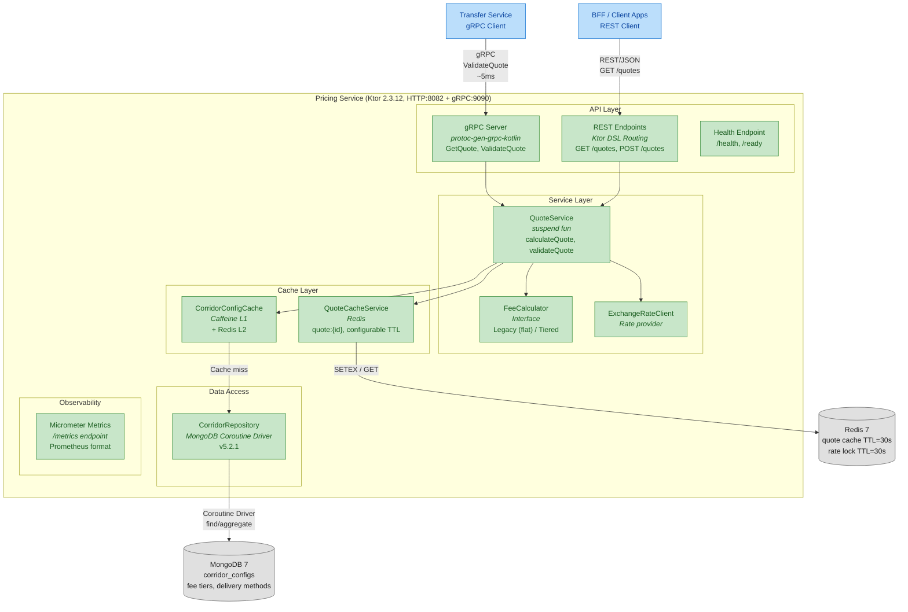

# Level 2: Pricing Service — Internal Architecture

> Детальная внутренняя структура Pricing Service (Ktor). Для whiteboard-интервью: нарисовать за 3–5 минут.

## Component Diagram



## Calculation Pipeline

```mermaid
graph LR
    REQ["GetQuote Request<br/>sendAmount, corridor,<br/>deliveryMethod"] --> CORRIDOR["Load Corridor Config<br/><i>Caffeine → Redis → MongoDB</i>"]
    CORRIDOR --> RATE["Get Exchange Rate<br/><i>ExchangeRateClient</i><br/>Redis cache TTL=30s"]
    RATE --> FEE["Calculate Fee<br/><i>Legacy: flat rate</i><br/><i>Tiered: progressive tiers</i>"]
    FEE --> CALC["Calculate Receive Amount<br/><i>(sendAmount - fee) × rate</i>"]
    CALC --> LOCK["Lock Quote<br/><i>Redis SETEX</i><br/>quote:{id} TTL=30s"]
    LOCK --> RESP["QuoteResponse<br/>quoteId, sendAmount,<br/>receiveAmount, rate, fee"]

    classDef step fill:#e8f5e9,stroke:#4caf50
    class REQ,CORRIDOR,RATE,FEE,CALC,LOCK,RESP step
```



## Tiered Fee Calculation

```
Fee Tiers (new-pricing-algorithm flag):
┌──────────────────┬──────────┬──────────────────────┐
│ Send Amount      │ Rate     │ Example ($300)       │
├──────────────────┼──────────┼──────────────────────┤
│ $0 – $100        │ 1.0%     │ $100 × 1.0% = $1.00 │
│ $100.01 – $500   │ 0.8%     │ $200 × 0.8% = $1.60 │
│ $500.01+         │ 0.5%     │ —                    │
├──────────────────┼──────────┼──────────────────────┤
│ Minimum fee      │ $0.99    │ Total: $2.60         │
└──────────────────┴──────────┴──────────────────────┘
```

## Ключевые решения

| Решение | Обоснование |
|---------|-------------|
| **Ktor (не Spring Boot)** | Stateless compute, ~40MB image vs ~200MB. Native coroutines. DSL routing. |
| **gRPC (не REST)** | Hot path: ~5ms vs ~15ms. Type-safe proto contract. HTTP/2 multiplexing. |
| **MongoDB (не PostgreSQL)** | Schema-less corridor configs. Nested fee tiers. Frequent changes without migrations. |
| **Caffeine L1 + Redis L2** | L1: in-process, ~0.1ms. L2: distributed, ~1ms. MongoDB: ~5-10ms. |
| **Quote Lock (Redis TTL=30s)** | Гарантирует что exchange rate не изменится между получением котировки и созданием перевода. |
| **Kotlinx.serialization** | Ktor ecosystem (не Jackson). Compile-time, no reflection. |
