# Level 2: Transfer Service — Internal Architecture

> Детальная внутренняя структура Transfer Service. Для whiteboard-интервью: нарисовать за 3–5 минут.

## Component Diagram

```mermaid
graph TB
    subgraph "Transfer Service (Spring Boot, port 8080)"
        direction TB

        subgraph "API Layer"
            RC["TransferController<br/><i>REST API</i><br/>POST/GET /api/v1/transfers"]
            SSE["SSE Endpoint<br/><i>Spring WebFlux</i><br/>GET /transfers/{id}/events"]
            SW["Swagger UI<br/>/swagger-ui"]
        end

        subgraph "Security Layer"
            SEC["SecurityConfig<br/><i>JWT RS256 + RBAC</i><br/>SENDER / OPERATOR / ADMIN"]
            RL["RateLimitFilter<br/><i>Redis Sliding Window</i><br/>100 req/min auth, 20 anon"]
        end

        subgraph "Service Layer"
            TS["TransferService<br/><i>@Transactional</i><br/>createTransfer, transitionStatus"]
            FS["FeeService<br/><i>Unleash Feature Flag</i><br/>new-pricing-algorithm"]
            TM["TransferMetrics<br/><i>Micrometer</i><br/>counters, timers"]
        end

        subgraph "Domain Model"
            SM["TransferStatus<br/><i>Sealed Class</i><br/>14 states, validated transitions"]
            TR["Transfer Entity<br/><i>@Version optimistic lock</i>"]
            OE["OutboxEvent Entity<br/><i>Transactional Outbox</i>"]
        end

        subgraph "Repository Layer"
            TREPO["TransferRepository<br/><i>Cursor-based pagination</i>"]
            OREPO["OutboxEventRepository"]
            RREPO["RecipientRepository"]
            CEREPO["ConsumedEventRepository<br/><i>Idempotent consumers</i>"]
        end

        subgraph "Kafka Consumers"
            PC["PaymentEventConsumer<br/><i>@RetryableTopic</i><br/>4 attempts, exp backoff"]
            POC["PayoutEventConsumer<br/><i>@RetryableTopic</i><br/>4 attempts, exp backoff"]
            NC["NotificationDeliveryConsumer<br/><i>Redirect & Retry</i><br/>ordering preserved"]
        end

        subgraph "External Clients"
            GC["PricingClient<br/><i>gRPC + Circuit Breaker</i><br/>ValidateQuote, ~5ms"]
            IC["IdentityClient<br/><i>REST + Circuit Breaker</i><br/>checkKyc"]
        end

        subgraph "Cache Layer"
            TSC["TransferStatusCache<br/><i>Caffeine</i><br/>maxSize=10K, TTL=5min"]
            TCC["TransferCacheService<br/><i>Redis Cache-Aside</i><br/>TTL=30s"]
        end

        subgraph "Real-time"
            PUB["TransferStatusPublisher<br/><i>Redis Pub/Sub → SSE</i>"]
        end

        subgraph "Distributed Lock"
            DL["ConsulDistributedLockService<br/><i>Consul KV</i><br/>TTL=15s, timeout=5s"]
        end
    end

    %% External Systems
    PG[(PostgreSQL 16<br/>transfers, outbox,<br/>recipients, consumed_events)]
    RD[(Redis 7<br/>cache, rate limit,<br/>Pub/Sub, idempotency)]
    KF{{Kafka<br/>23 topics<br/>7-day retention}}
    PS[Pricing Service<br/>Ktor, gRPC:9090]
    IS[Identity Service<br/>REST API]
    CS[Consul<br/>KV Store]
    UL[Unleash<br/>Feature Flags]
    CLIENT[Client / BFF]

    %% Connections — API
    CLIENT -->|"REST + JWT"| SEC
    SEC --> RL
    RL --> RC
    CLIENT -->|"SSE stream"| SSE

    %% Connections — Service
    RC --> TS
    TS --> FS
    TS --> TM
    FS -->|"isEnabled?"| UL

    %% Connections — Domain
    TS --> SM
    TS --> TR
    TS --> OE

    %% Connections — Repository
    TS --> TREPO
    TS --> OREPO
    TS --> RREPO
    TREPO --> PG
    OREPO --> PG
    RREPO --> PG
    CEREPO --> PG

    %% Connections — Cache
    TS --> TSC
    RC --> TCC
    TCC -->|"GET/SET TTL=30s"| RD
    RL -->|"Lua script ZSET"| RD

    %% Connections — External
    TS -->|"gRPC<br/>Circuit Breaker"| GC
    GC --> PS
    TS -->|"REST<br/>Circuit Breaker"| IC
    IC --> IS

    %% Connections — Lock
    TS --> DL
    DL -->|"KV acquire/release"| CS

    %% Connections — Kafka
    PC -->|"payments.payment.*"| KF
    POC -->|"payouts.payout.*"| KF
    NC -->|"notification.delivery"| KF
    PC --> CEREPO
    POC --> CEREPO

    %% Connections — Real-time
    TS --> PUB
    PUB -->|"PUBLISH"| RD
    SSE -->|"SUBSCRIBE"| RD

    %% Styling
    classDef green fill:#c8e6c9,stroke:#388e3c,color:#1b5e20
    classDef blue fill:#bbdefb,stroke:#1976d2,color:#0d47a1
    classDef orange fill:#ffe0b2,stroke:#f57c00,color:#e65100
    classDef gray fill:#e0e0e0,stroke:#616161,color:#212121
    classDef red fill:#ffcdd2,stroke:#d32f2f,color:#b71c1c

    class RC,SSE,SW,TS,FS,TM,SM,TR,OE,TREPO,OREPO,RREPO,CEREPO,PC,POC,NC,GC,IC,TSC,TCC,PUB,DL,SEC,RL green
    class PS,IS,CS,UL blue
    class KF orange
    class PG,RD gray
    class CLIENT red
```

## Ключевые паттерны

| Паттерн | Где | Зачем |
|---------|-----|-------|
| **Outbox Pattern** | TransferService → OutboxEvent + Transfer в одной @Transactional | Guaranteed event delivery |
| **Circuit Breaker** | PricingClient, IdentityClient (Resilience4j) | Graceful degradation |
| **Cache-Aside** | TransferCacheService (Redis, TTL=30s) | Reduce DB load |
| **Distributed Lock** | ConsulDistributedLockService (Consul KV) | Idempotency, concurrency control |
| **Redirect & Retry** | NotificationDeliveryConsumer | Ordering preservation |
| **Feature Flag** | FeeService → Unleash | Safe rollout |
| **Sliding Window** | RateLimitFilter (Redis Lua) | Rate limiting |
| **Optimistic Locking** | Transfer @Version | Concurrent status updates |
| **Sealed Class State Machine** | TransferStatus (14 states) | Validated transitions |

## Потоки данных

1. **Synchronous (hot path):** Client → REST → SecurityConfig → RateLimitFilter → TransferController → TransferService → [Consul Lock] → [Identity REST + CB] → [Pricing gRPC + CB] → PostgreSQL (Transfer + Outbox) → Redis (cache, SSE) → 201 Created
2. **Asynchronous (Kafka):** Outbox Service polls → Kafka → PaymentEventConsumer → ConsumedEvent check → TransferService.transitionStatus() → PostgreSQL + Caffeine cache
3. **Real-time (SSE):** TransferService → Redis PUBLISH → SSE Endpoint → Client (EventSource)
