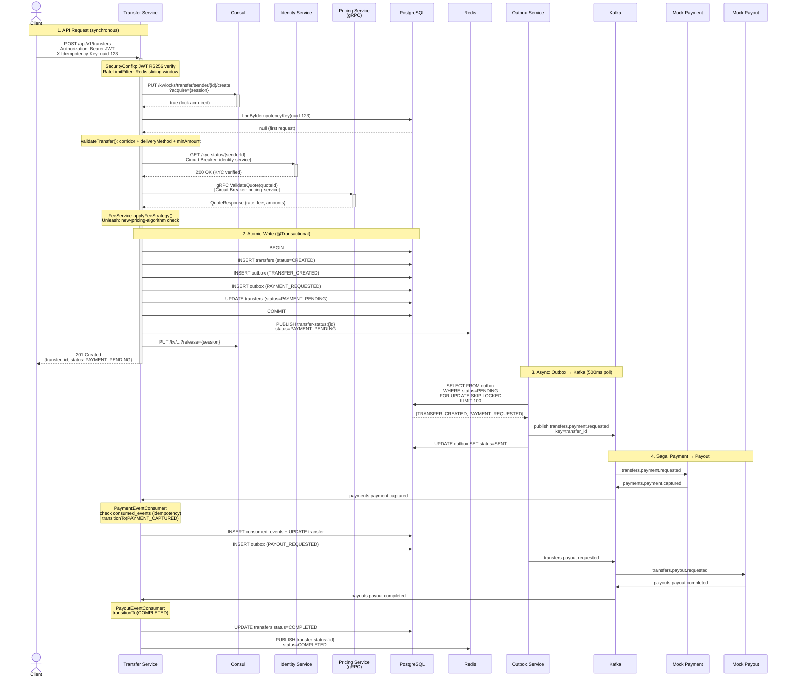
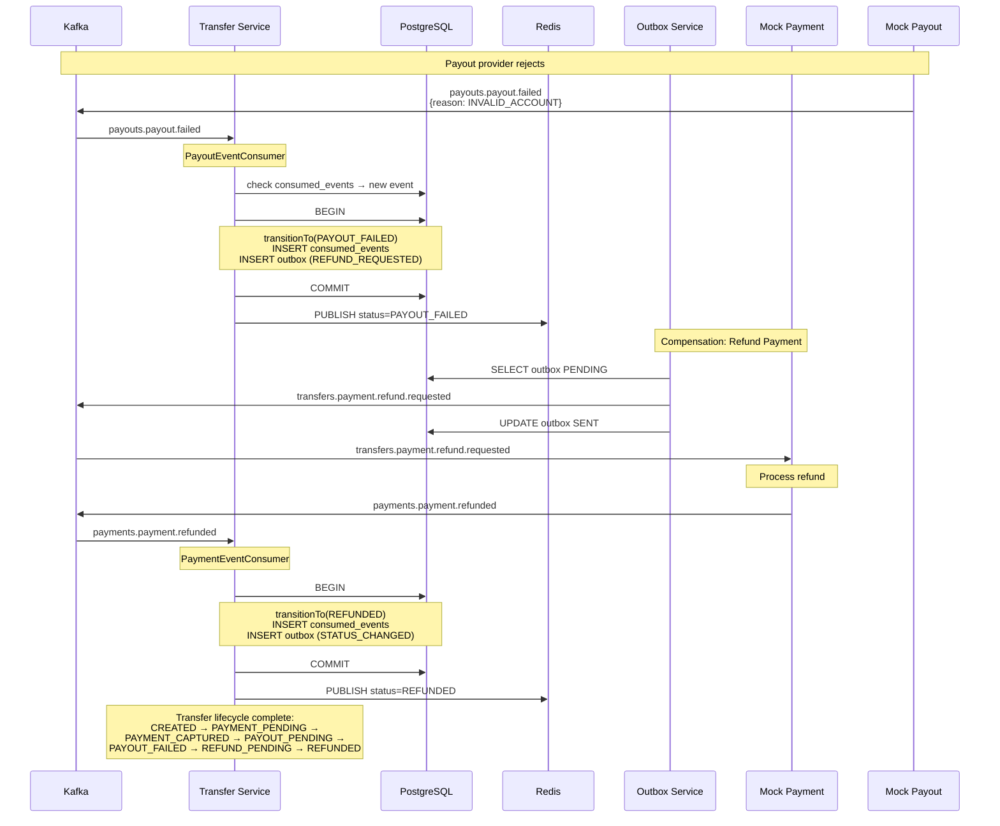
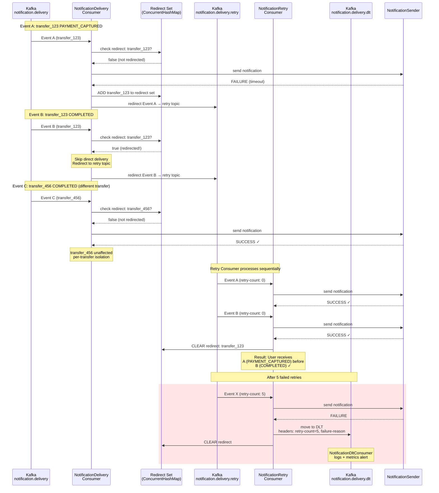
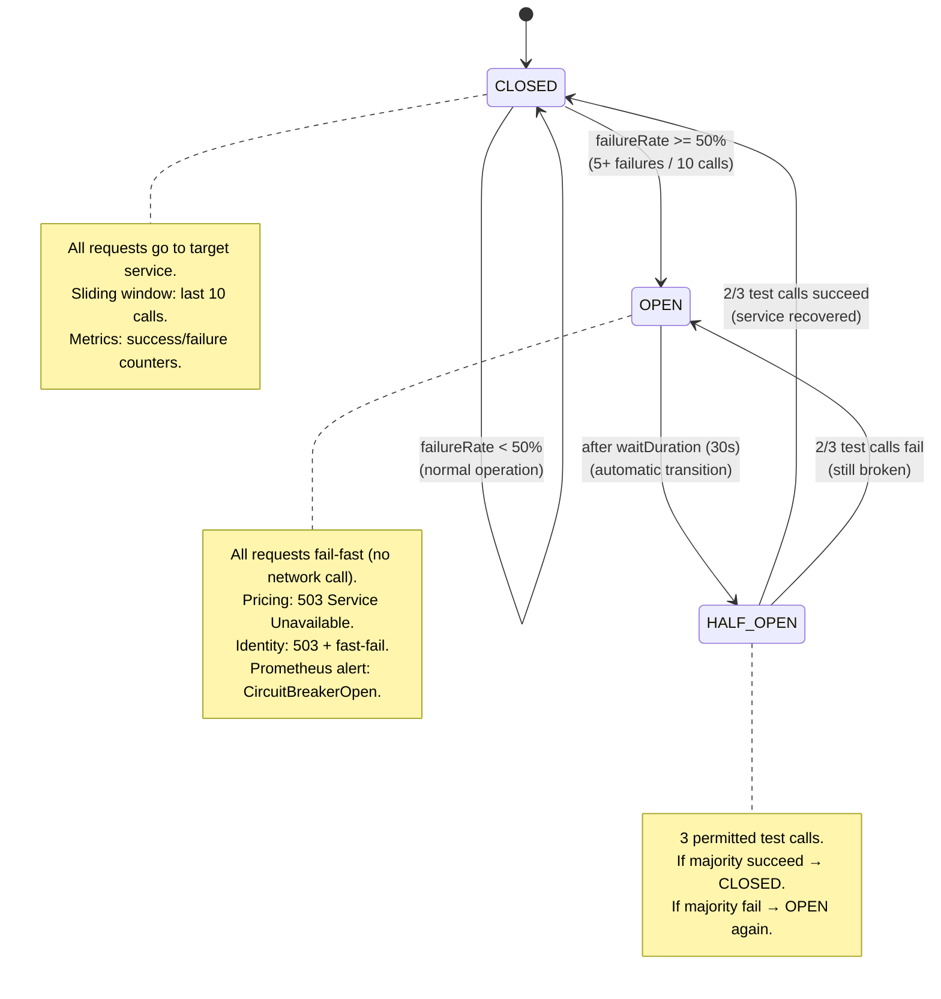

# Level 3: Flow Diagrams — Key Scenarios

> Пошаговые сценарии для whiteboard-интервью. Четыре ключевых flow, которые спрашивают на собеседованиях.

---

## Flow 1: Create Transfer — Happy Path

---

## Flow 2: Saga Compensation — Payout Failed

---

## Flow 3: Redirect & Retry — Ordering Preserved

---

## Flow 4: Circuit Breaker State Transitions

### Circuit Breaker Configuration (application.yml)

| Parameter | pricing-service | identity-service |
|-----------|----------------|-----------------|
| slidingWindowSize | 10 | 10 |
| failureRateThreshold | 50% | 50% |
| slowCallDurationThreshold | 2s | 1s |
| waitDurationInOpenState | 30s | 30s |
| permittedCallsInHalfOpen | 3 | 3 |
| minimumNumberOfCalls | 5 | 5 |

### Fallback Strategies

| Service | CB Open Behavior | Rationale |
|---------|-----------------|-----------|
| **Pricing Service** | 503 → client retries with exponential backoff | Cannot create transfer without valid quote |
| **Identity Service** | 503 → fast-fail, no KYC = no transfer | Compliance requirement, cannot skip |
| **OpenAI API** (LLM) | Vector search fallback → return top document | Graceful degradation, answer without LLM |
| **Redis** (Rate Limit) | Fail-open → allow request | Availability > strict limiting |
