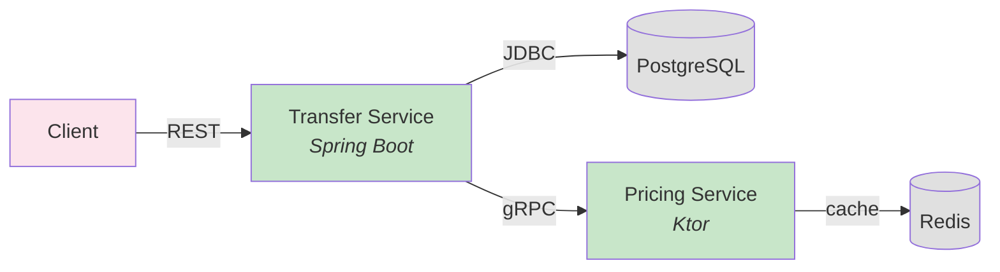
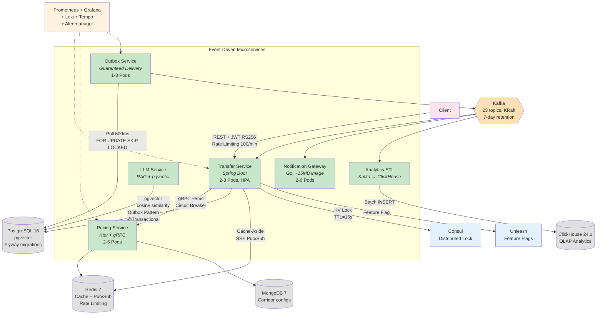

# Level 4: Infrastructure & Deployment Diagram

> Kubernetes deployment topology. Для whiteboard-интервью: показать как всё задеплоено.

## Kubernetes Deployment

```mermaid
graph TB
    subgraph "AWS Cloud"
        subgraph "VPC (10.0.0.0/16)"
            subgraph "Public Subnets (3 AZs)"
                IGW[Internet Gateway]
                ALB[Application Load Balancer<br/><i>Ingress Controller (nginx)</i>]
                NAT[NAT Gateway]
            end

            subgraph "EKS Cluster"
                subgraph "Namespace: transferhub"
                    TS["Transfer Service<br/>2–8 Pods (HPA: CPU 60%)<br/>512Mi/1Gi, 250m/1000m<br/>Port: 8080"]
                    PS["Pricing Service<br/>2–6 Pods (HPA: CPU 60%)<br/>256Mi/512Mi, 100m/500m<br/>HTTP:8082 + gRPC:9090"]
                    OB["Outbox Service<br/>1–3 Pods (HPA: lag 1K)<br/>256Mi/512Mi, 100m/500m<br/>Port: 8081"]
                    NG["Notification Gateway<br/>2–6 Pods (HPA: CPU 60%)<br/>64Mi/128Mi, 50m/250m<br/>Go, Port: 8085"]
                    LLM["LLM Service<br/>2 Pods<br/>512Mi/1Gi<br/>Port: 8087"]
                    ETL["Analytics ETL<br/>1–2 Pods<br/>256Mi/512Mi<br/>Port: 8088"]
                end

                subgraph "Namespace: infra"
                    CONSUL["Consul<br/>3 Pods (StatefulSet)<br/>Port: 8500"]
                    UNLEASH["Unleash<br/>1 Pod<br/>Port: 4242"]
                end

                subgraph "Namespace: monitoring"
                    PROM["Prometheus<br/>v2.50<br/>15s scrape"]
                    GRAF["Grafana<br/>v10.3<br/>3 dashboards"]
                    LOKI["Loki<br/>v2.9.4<br/>7d retention"]
                    TEMPO["Tempo<br/>v2.3.1<br/>OTLP receiver"]
                    AM["Alertmanager<br/>v0.27<br/>P1→PagerDuty"]
                end
            end

            subgraph "Private Subnets (3 AZs)"
                RDS["RDS PostgreSQL 16<br/><i>Multi-AZ, encrypted</i><br/><i>pgvector + pg_stat_statements</i><br/>db.t3.medium, 20GB"]
                ELASTI["ElastiCache Redis 7<br/><i>cluster mode</i><br/>256MB, LRU eviction"]
                MSK["MSK (Kafka) 7.6<br/><i>KRaft mode, 3 brokers</i><br/>23 topics, 7d retention"]
                MONGO["DocumentDB / MongoDB 7<br/><i>corridor configs</i>"]
                CH["ClickHouse 24.1<br/><i>OLAP analytics</i><br/>ReplacingMergeTree"]
            end
        end

        S3["S3<br/><i>Terraform state</i><br/><i>Backups, artifacts</i><br/>encrypted, versioned"]
        DYNAMO["DynamoDB<br/><i>Terraform locks</i>"]
    end

    OPENAI["OpenAI API<br/><i>GPT-4, embeddings</i>"]
    USERS["Users / Mobile Apps"]
    PAGERDUTY["PagerDuty"]
    SLACK["Slack #alerts"]

    %% Inbound
    USERS -->|HTTPS| IGW
    IGW --> ALB
    ALB -->|"/"| TS
    ALB -->|"/quotes"| PS

    %% Service → Data
    TS -->|"JDBC"| RDS
    TS -->|"GET/SET"| ELASTI
    TS -->|"KV lock"| CONSUL
    OB -->|"JDBC"| RDS
    OB -->|"produce"| MSK
    PS -->|"coroutine"| MONGO
    PS -->|"cache"| ELASTI
    LLM -->|"pgvector"| RDS
    LLM -->|"API"| OPENAI
    ETL -->|"consume"| MSK
    ETL -->|"batch INSERT"| CH

    %% Kafka consumers
    TS -.->|"consume"| MSK
    NG -.->|"consume"| MSK

    %% Monitoring
    PROM -.->|"scrape"| TS
    PROM -.->|"scrape"| PS
    PROM -.->|"scrape"| OB
    PROM -.->|"scrape"| NG
    AM -->|"P1"| PAGERDUTY
    AM -->|"P2"| SLACK
    GRAF --> PROM
    GRAF --> LOKI
    GRAF --> TEMPO
    GRAF --> CH

    %% Feature flags
    TS -.->|"flags"| UNLEASH

    classDef app fill:#c8e6c9,stroke:#388e3c
    classDef data fill:#e0e0e0,stroke:#616161
    classDef monitor fill:#fff3e0,stroke:#f57c00
    classDef infra fill:#e3f2fd,stroke:#1976d2
    classDef external fill:#fce4ec,stroke:#d32f2f

    class TS,PS,OB,NG,LLM,ETL app
    class RDS,ELASTI,MSK,MONGO,CH,S3,DYNAMO data
    class PROM,GRAF,LOKI,TEMPO,AM monitor
    class CONSUL,UNLEASH,ALB,NAT,IGW infra
    class OPENAI,USERS,PAGERDUTY,SLACK external
```

---

# «Было / Стало» — Эволюция архитектуры

> Самый мощный артефакт для собеседования: показывает эволюцию и обосновывает каждое усложнение.

## «Было» — Sprint 0–1 (MVP)



**Что есть:**
- 2 сервиса, синхронные вызовы
- PostgreSQL для данных, Redis для кэша
- Один happy path: создать перевод, получить котировку

**Чего нет:**
- ❌ Kafka, ❌ events, ❌ async
- ❌ Retry, ❌ error handling
- ❌ Monitoring, ❌ alerting
- ❌ Security (JWT, rate limiting)
- ❌ Saga, ❌ compensations

---

## «Стало» — Sprint 7 (Production-Ready)



---

## Причины каждого усложнения

| Что добавили | Когда | Проблема, которую решили | Паттерн |
|---|---|---|---|
| **Outbox Pattern** | Sprint 2 | Crash между DB commit и Kafka send → потеря события → зависший перевод | Transactional Outbox |
| **Choreography Saga** | Sprint 2 | Нужен multi-step lifecycle (payment → payout) без distributed transactions | Saga + Compensation |
| **Circuit Breaker** | Sprint 3 | Timeout к Pricing (2s) → thread pool exhaustion → cascading failure | Resilience4j CB |
| **Redirect & Retry** | Sprint 4 | @RetryableTopic нарушал ordering нотификаций (B перед A) | Custom Redirect Pattern |
| **Consul Distributed Lock** | Sprint 3 | Race condition: 2 Pod'а создают перевод с одним idempotency key | Distributed Mutual Exclusion |
| **Redis Rate Limiting** | Sprint 5 | DDoS/abuse protection, compliance requirement | Sliding Window (Lua) |
| **JWT + RBAC** | Sprint 5 | API без аутентификации → любой может создать перевод | RS256 + Role-based Access |
| **PII Masking** | Sprint 5 | Email/phone в логах → GDPR violation | Logback Converter |
| **Unleash Feature Flags** | Sprint 4 | Trunk-based dev: незавершённая фича видна всем | Feature Toggle |
| **Caffeine Cache** | Sprint 6 | ConcurrentHashMap → unbounded → OOM через 36 часов (memory leak) | Bounded Cache (W-TinyLFU) |
| **LLM + RAG** | Sprint 6 | Пользователям нужен AI-ассистент для FAQ | RAG + pgvector |
| **ClickHouse + ETL** | Sprint 6 | PostgreSQL агрегации ~5s на 1M строк, нужно <200ms | CQRS-light (OLTP + OLAP) |
| **Full Observability** | Sprint 4-5 | «Что-то сломалось» → grep по логам 6 сервисов → часы дебага | Prometheus + Grafana + Loki + Tempo |

---

## Интервью pitch

> «Вот как система выглядела в начале — простой REST + PostgreSQL, два сервиса, один happy path. А вот как выглядит сейчас — 8 сервисов, event-driven, полный observability стек.
>
> Каждое усложнение обосновано конкретной проблемой. Например, Outbox Pattern появился, когда мы обнаружили, что при crash между commit в БД и отправкой в Kafka — событие терялось. Это стоило нам зависшего перевода на staging.
>
> Circuit Breaker добавили, когда timeout к Pricing Service зависал на 2 секунды и исчерпывал thread pool — cascading failure. Redirect & Retry — когда QA обнаружил, что @RetryableTopic нарушает ordering нотификаций.
>
> Я не утверждаю, что архитектура идеальна — если бы начинал заново, добавил бы Schema Registry и contract tests с первого дня. Но каждое решение было принято осознанно, задокументировано в ADR, и подтверждено метриками.»
